# Wine Quality Prediction: Elastic Net vs Random Forest

Predicting Vinho Verde wine quality from physicochemical properties using two supervised learning approaches — Elastic Net (regularised linear regression) and Random Forest (nonlinear ensemble).

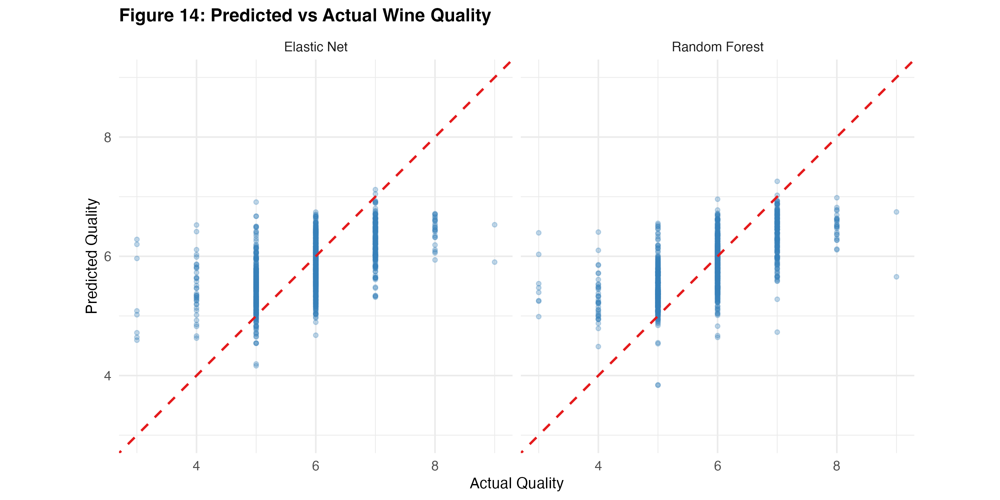

## Dataset

The [Wine Quality dataset](https://archive.ics.uci.edu/ml/datasets/wine+quality) from the UCI Machine Learning Repository, originally collected by Cortez et al. (2009).

- **1,599** red wine samples + **4,898** white wine samples
- **11** physicochemical features (fixed acidity, volatile acidity, residual sugar, chlorides, sulphates, alcohol, density, pH, etc.)
- **1** response variable: quality score (integer, 3–9), median of at least 3 blind tastings by certified sommeliers
- After removing 1,177 duplicates: **5,320** observations

To use this code, download the two CSV files from UCI and place them in a `data/` folder:

```
data/
  winequality-red.csv
  winequality-white.csv
```

Direct download links:
- [winequality-red.csv](https://archive.ics.uci.edu/ml/machine-learning-databases/wine-quality/winequality-red.csv)
- [winequality-white.csv](https://archive.ics.uci.edu/ml/machine-learning-databases/wine-quality/winequality-white.csv)

## Methods

### Elastic Net

Regularised linear regression combining L1 (Lasso) and L2 (Ridge) penalties. Hyperparameters tuned via 10-fold cross-validation:

- **Alpha** (L1/L2 mixing): searched over 0.0–1.0 in steps of 0.1. Optimal alpha = **0.1** (mostly Ridge), consistent with the high multicollinearity among predictors.
- **Lambda** (regularisation strength): optimal lambda = **0.006**, selected by `cv.glmnet`.

### Random Forest

Ensemble of 500 decision trees with bootstrap sampling and random feature subsets at each split.

- **mtry** (features per split): searched over 2–12. Optimal mtry = **3**, below the default p/3 ≈ 4, suggesting more diverse splits improve decorrelation.
- **ntree**: OOB error stabilises around 300 trees; 500 used for the final model.

Both models share identical 10-fold CV folds for fair comparison.

## Results

| Metric | Elastic Net | Random Forest |
|--------|-------------|---------------|
| Test RMSE | 0.7120 | **0.6715** |
| Test MAE | 0.5447 | **0.5082** |
| Test R² | 0.3423 | **0.4149** |

Random Forest outperforms Elastic Net across all metrics (5.7% lower RMSE, 7.3 percentage points more variance explained), confirming that the feature–quality relationship is nonlinear.

Both models agree on the top predictors:

1. **Alcohol** — strongest positive association with quality
2. **Volatile acidity** — strongest negative association (acetic acid = vinegar off-flavour)
3. **Density** — negatively correlated, partly redundant with alcohol

### Key Figures

| | |
|:---:|:---:|
| 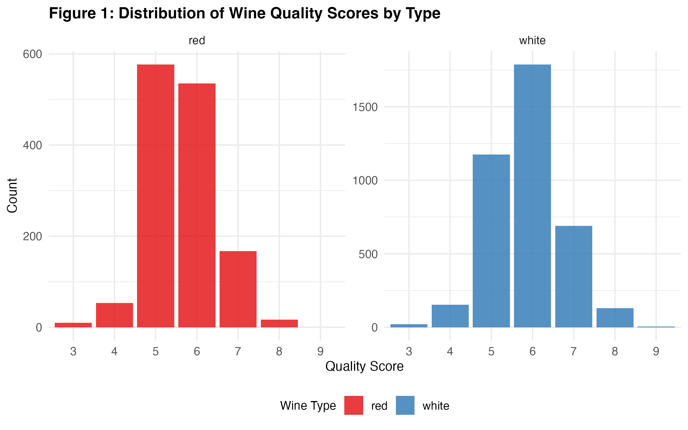 | 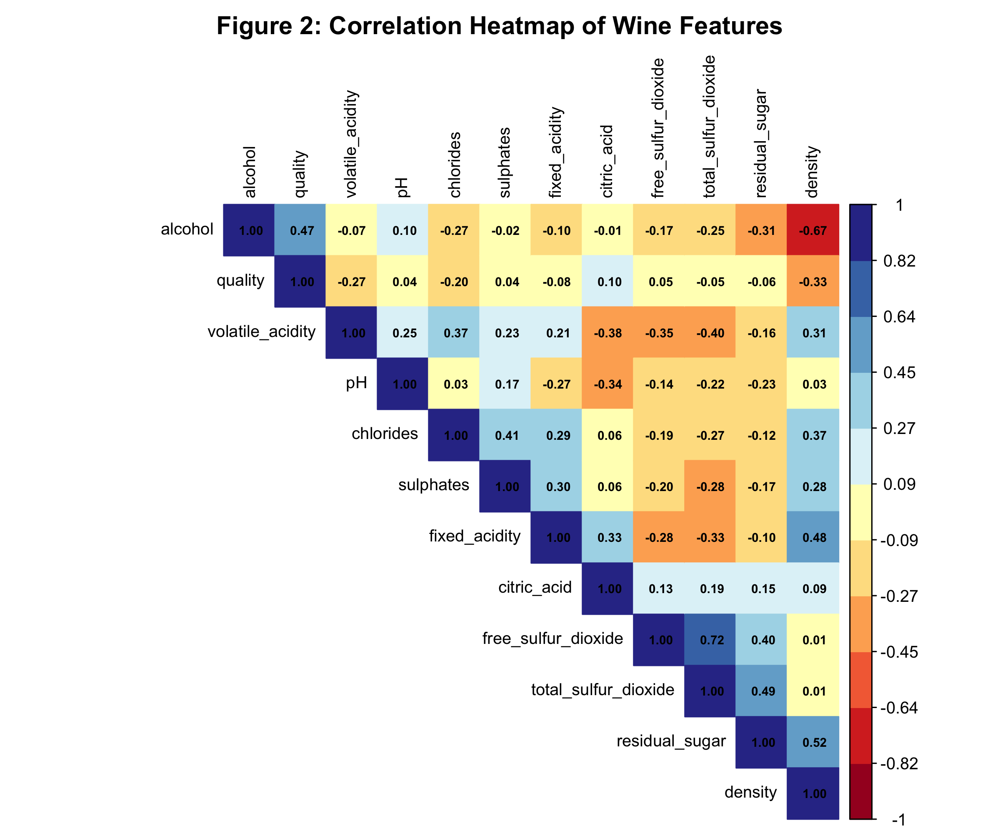 |
| Quality score distribution | Correlation heatmap |
| 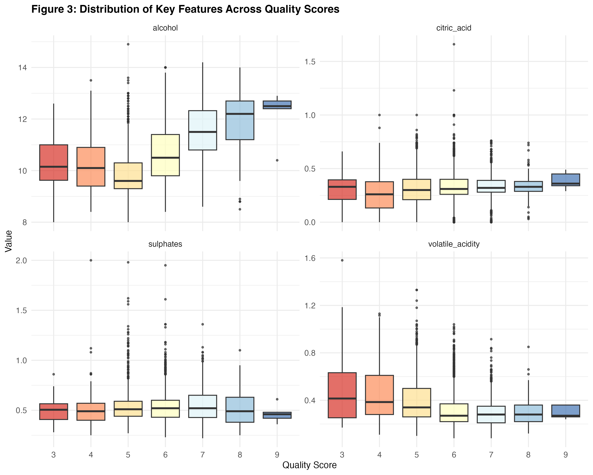 | 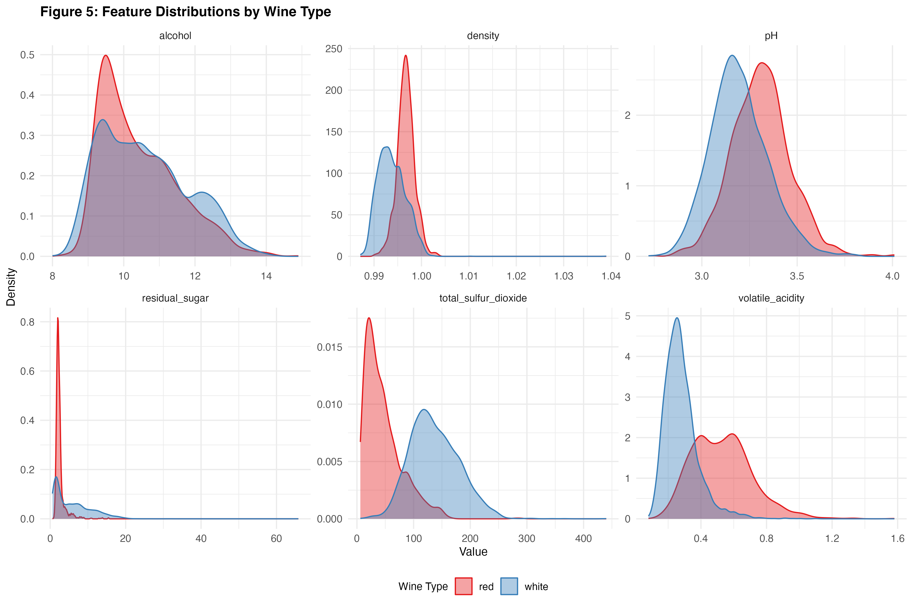 |
| Features vs quality | Red vs white distributions |
| 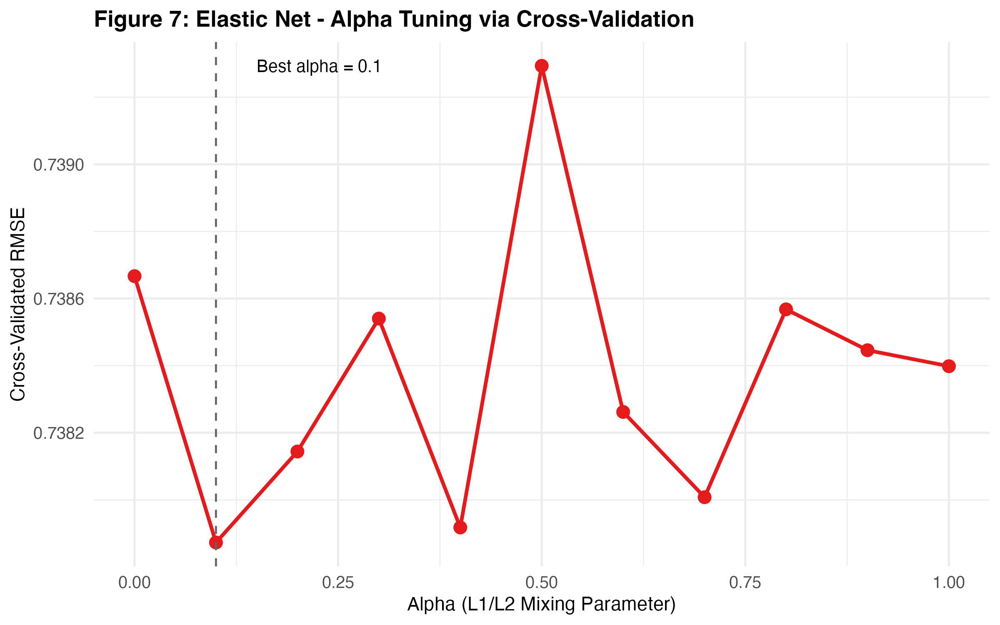 | 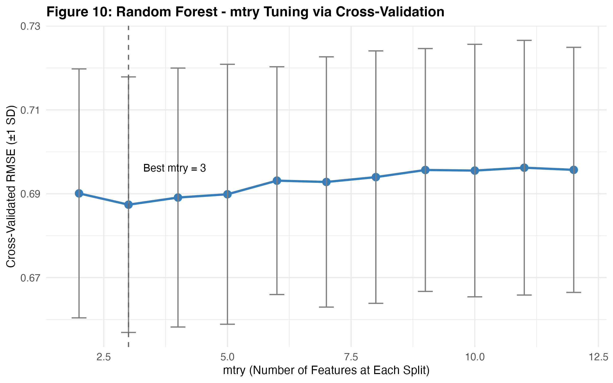 |
| Elastic Net alpha tuning | Random Forest mtry tuning |
| 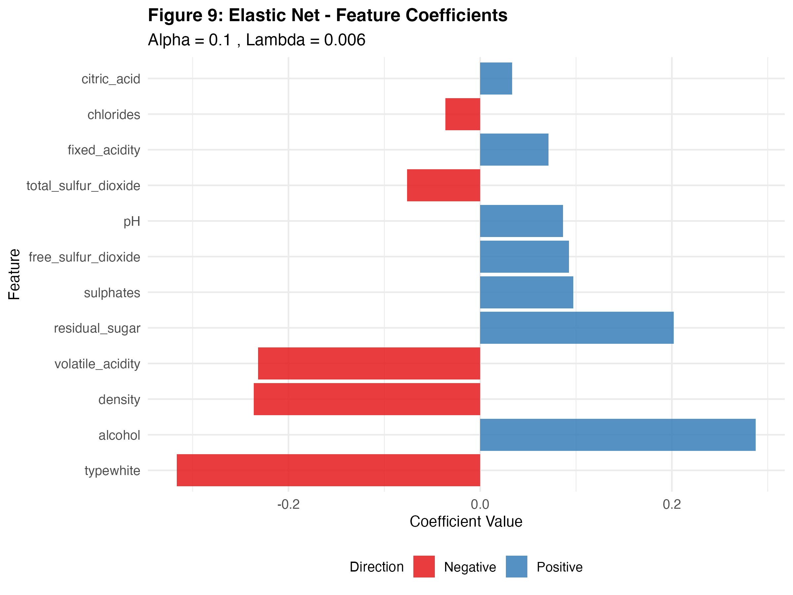 | 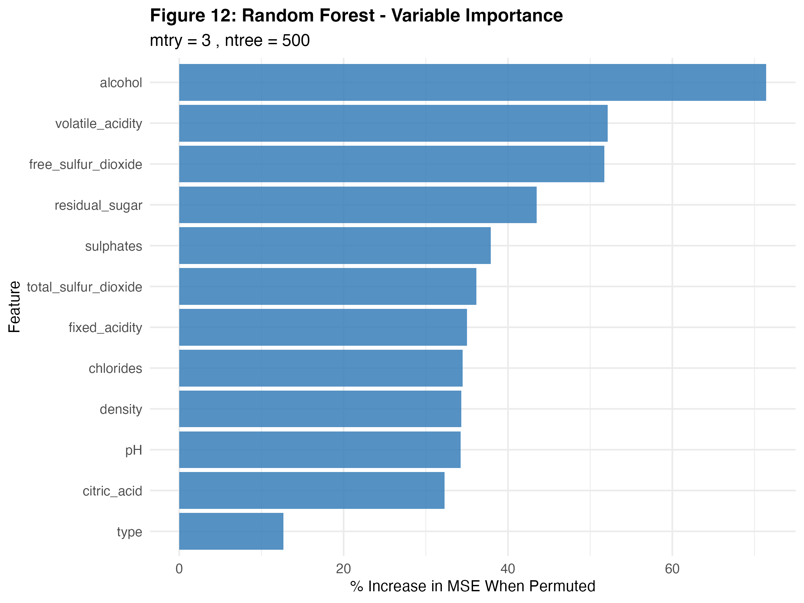 |
| Elastic Net coefficients | Random Forest variable importance |
| 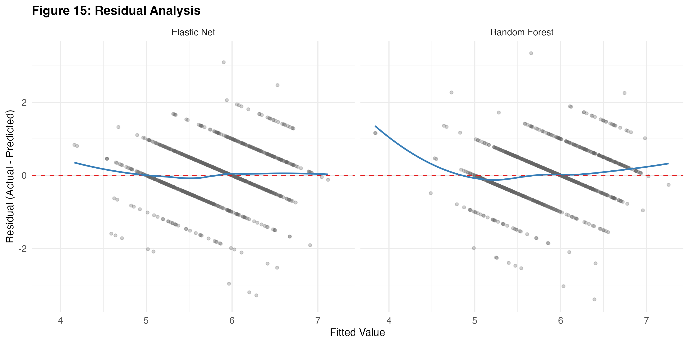 | 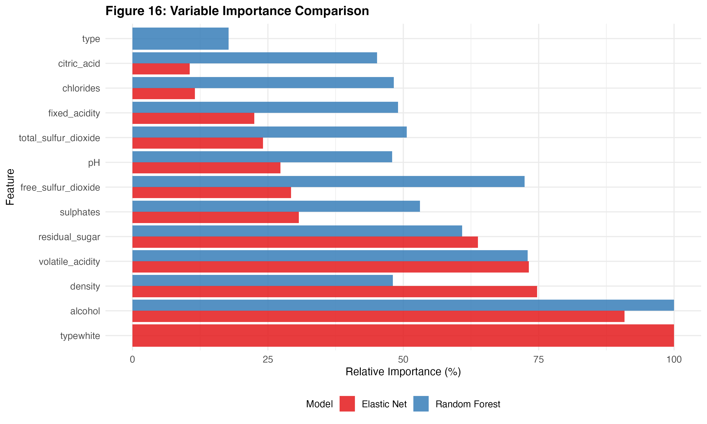 |
| Residual analysis | Variable importance comparison |

## Project Structure

```
.
├── README.md
├── wine_analysis.R          # Full analysis pipeline (R)
├── figures/                  # All generated plots (300 DPI)
│   ├── fig1_quality_distribution.png
│   ├── fig2_correlation_heatmap.png
│   ├── ...
│   └── fig16_variable_importance_comparison.png
└── data/                     # Download from UCI (not included)
    ├── winequality-red.csv
    └── winequality-white.csv
```

## Requirements

R 4.3+ with the following packages:

```r
tidyverse
caret
glmnet
randomForest
RColorBrewer
corrplot
```

The script auto-installs missing packages on first run.

## How to Run

```bash
# 1. Clone the repo
git clone https://github.com/YOUR_USERNAME/wine-quality-prediction.git
cd wine-quality-prediction

# 2. Download data
mkdir data
curl -o data/winequality-red.csv https://archive.ics.uci.edu/ml/machine-learning-databases/wine-quality/winequality-red.csv
curl -o data/winequality-white.csv https://archive.ics.uci.edu/ml/machine-learning-databases/wine-quality/winequality-white.csv

# 3. Run analysis
Rscript wine_analysis.R
```

Or open `wine_analysis.R` in RStudio and run interactively.

## References

- Cortez, P., Cerdeira, A., Almeida, F., Matos, T., & Reis, J. (2009). Modeling wine preferences by data mining from physicochemical properties. *Decision Support Systems*, 47(4), 547–553. https://doi.org/10.1016/j.dss.2009.05.016

- Dewi, C., & Chen, R.-C. (2019). Random forest and support vector machine on features selection for regression analysis. *International Journal of Innovative Computing, Information and Control*, 15(6), 2027–2037.

- Bhardwaj, P., Tiwari, P., Olejar, K., Parr, W., & Kulasiri, D. (2022). A machine learning application in wine quality prediction. *Machine Learning with Applications*, 8, 100261. https://doi.org/10.1016/j.mlwa.2022.100261
